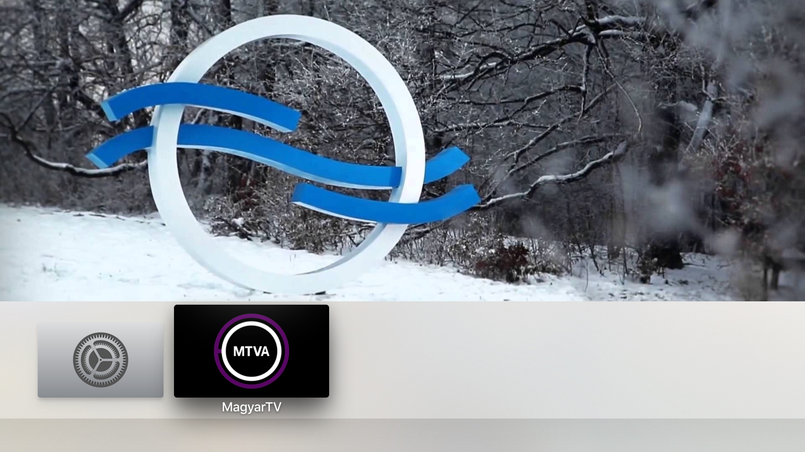
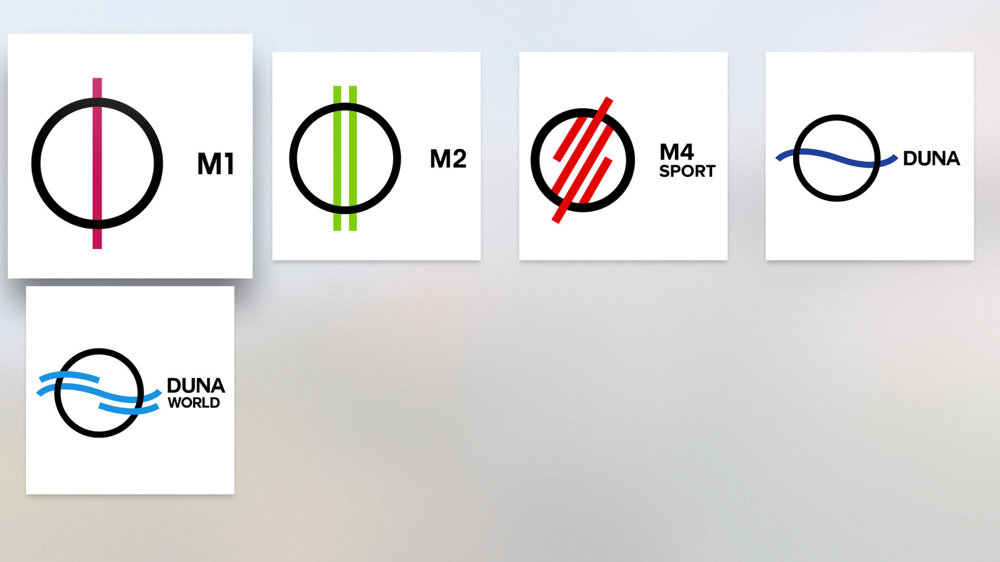

# MagyarTV

Csináld magad magyar TV csatornák Apple TV 4-re ingyen!

* M1
* M2
* M4 Sport
* Duna TV
* Duna World




## Telepítés

1. [Töltsd le](https://github.com/gklka/MagyarTV/archive/master.zip)
2. ha nincs fent, akkor telepítsd a CocoaPods-ot:

	```
	$ sudo gem install cocoapods
	```

3. lépj be Terminal-ban a project könyvtárába és telepítsd a pod-okat:

	```
	$ pod install
	```

4. A fehér ikonos `MagyarTV.xcworkspace` fájlt megnyitva az Xcode-ból tudod lefordítani a programot. Az Apple TV 4-et csatlakoztatni kell USB-C kábellel a géphez és az Xcode felső sávjában ki kell választani.

## Tudnivalók

A program által megjelenített tartalom az MTVA szervereiről érkezik, ahogyan azt mediaklikk.hu honlap is megjeleníti. A program nem manipulálja ezeket a streameket.

## GYIK

### Miért nincs kint a program az App Store-ban?

Mert az MTVA nem méltatott válaszra, az ő engedélyük nélkül pedig nem lehetséges a program publikálása.
